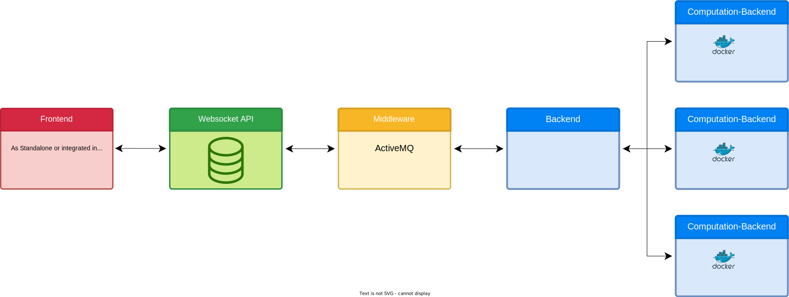

# Architecture

## General Architecture

<figure markdown>
  
  <figcaption>ViPLab Architecture: General Overview</figcaption>
</figure>

### Components

#### Frontend
The *ViPLab Frontend* is a browser-based web application. 
It was developed using the JavaScript Framework Vue.js. 
The user can enter his/her input using the graphical interface. 
If the user sends the input, a JSON message is generated and sent to the Websocket API.

An overview with descriptions of the Frontend can be found here: [ViPLab Frontend](../user/frontend.md).

The Repository containing the Code is published on [GitHub](https://github.com/VirtualProgrammingLab/viplab-vue-frontend).

#### Websocket API

The *Websocket-Api* can be used by the clients to interact with ViPLab. 
For this it is necessary that th clients authenticate and autorize themselves using JSON Web Tokens (JWTs). 
Following this process, messages can be exchanged, to start a computation using ViPLab. 
To enable the computation, all necessary information has to be part of the Websocket message. 
The messages sent are JSON messages, which are partly described in the [Developer Guide](../developer/index.md). 
Once the result was computed, the client is informed. 

Additionally there is a Database, which is used to save Computations and their results. 
But it is no durable location for saving user data. 
The Backends have no access to this DB, so all relevant information has to be sent to the Backends using the Middleware. 

The Repository containing the code of the Websocket API can be found on [Git](https://github.com/VirtualProgrammingLab/viplab-websocket-api) and is written in Java. 

#### Middleware

As *Middleware* [Apache ActiveMQ](https://activemq.apache.org/) is used. 
To be more precise [ActiveMQ Artemis](https://activemq.apache.org/components/artemis/documentation/). 
Apache ActiveMQ Artemis enables asynchronous messaging between the Websocket API and the Backend and thus also asynchonous processing in the Backend(s).

#### Backend

The ViPLab *Backend* is based on Python. 
It is used to evaluate the input made using the Frontend. 
For this the specified Docker-Container is executed. 
Alternatively, the code is executed inside a previously defined Container, e.g. C-Code is executed inside a Container that can run C-Code. 
After that, the result is reported back to the client via ActiveMQ and the Websocket API.

The code can be found [here](https://github.com/VirtualProgrammingLab/ViPLab-Backend).