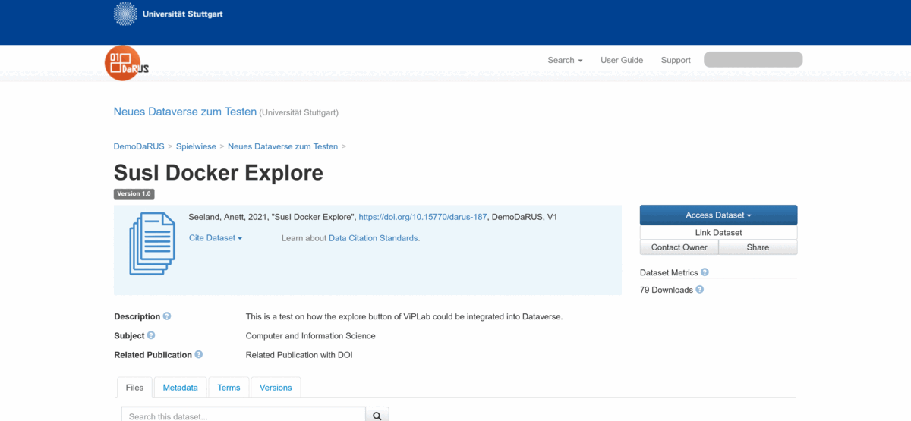
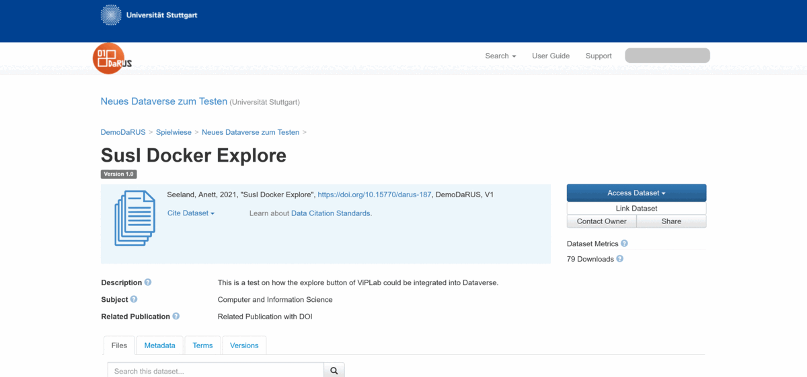

# ViPLab in DaRUS

This is how you can use ViPLab in DaRUS...

## Creating a Computation Template in a Dataset

<figure markdown>
  
  <figcaption>Create a Computation Template in DaRUS</figcaption>
</figure>

## Reproduce a Result using ViPLab in DaRUS

<figure markdown>
  
  <figcaption>Inspect a Computation Template in DaRUS</figcaption>
</figure>