# ViPLab Frontend

This Page will give you an Overview over the ViPLab Frontend

---

## Overview

<figure markdown>
  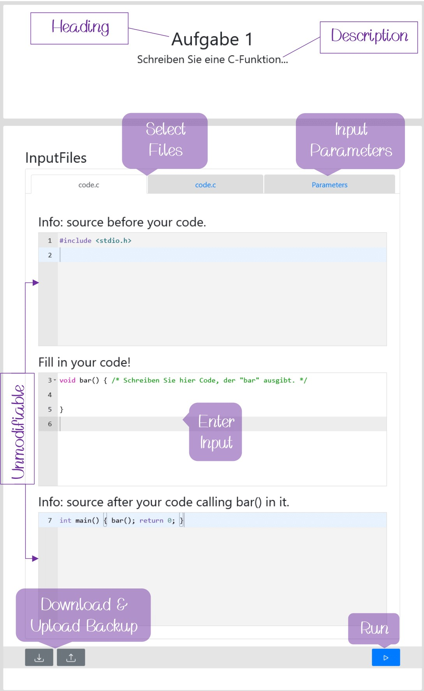
  <figcaption>ViPLab Frontend</figcaption>
</figure>

---

## Parameters

### Parameters: As Form

<figure markdown>
  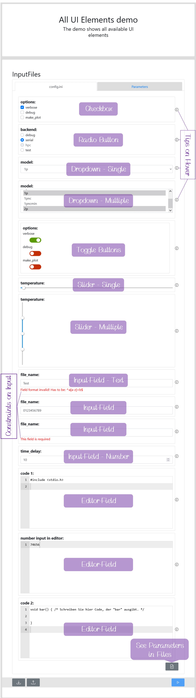
  <figcaption>ViPLab Frontend - Parameters As Form</figcaption>
</figure>

### Parameters: As File

<figure markdown>
  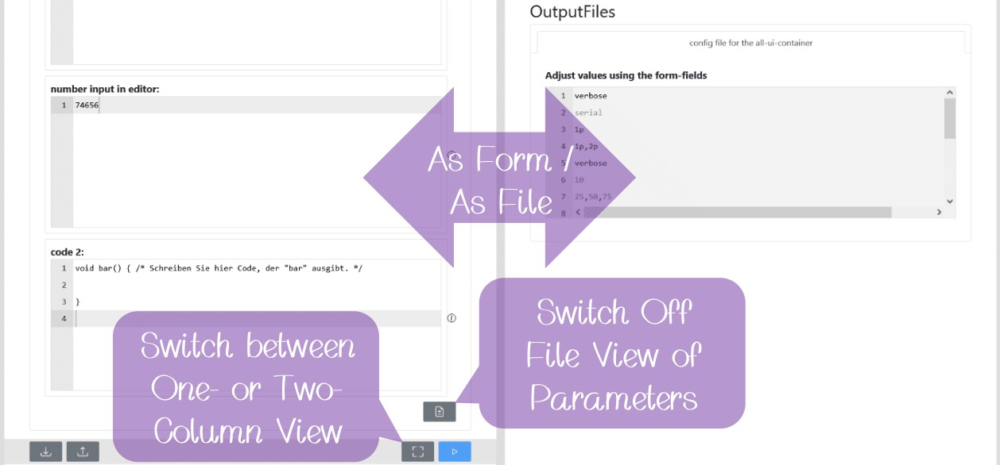
  <figcaption>ViPLab Frontend - Parameters As File</figcaption>
</figure>

---

## Results

### Stdout / Stderr Tab

<figure markdown>
  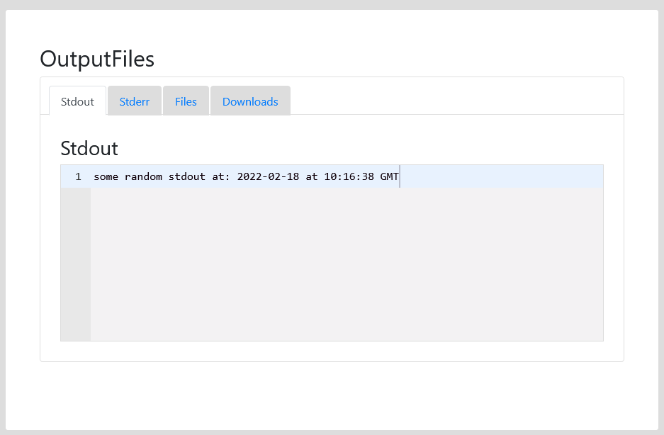
  <figcaption>ViPLab Frontend - Stdout</figcaption>
</figure>

### Files Tab

<figure markdown>
  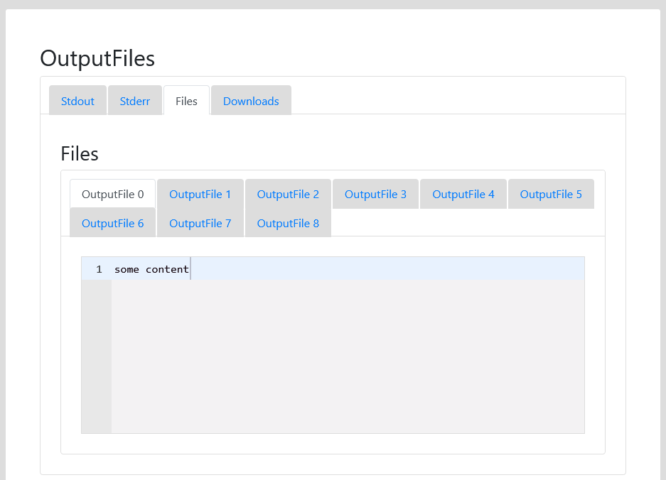
  <figcaption>ViPLab Frontend - Files Tab</figcaption>
</figure>

#### Text

<figure markdown>
  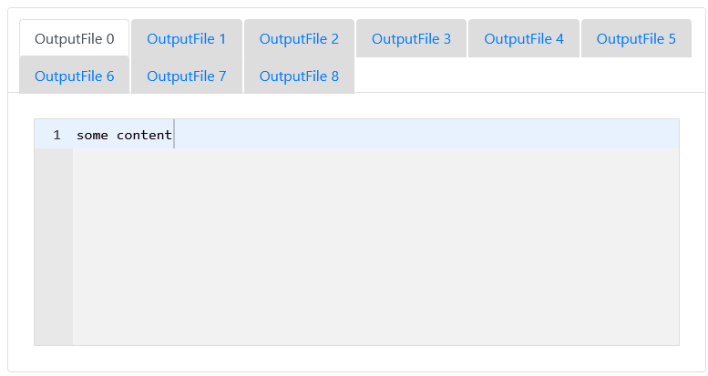
  <figcaption>ViPLab Frontend - Text</figcaption>
</figure>

#### Images

<figure markdown>
  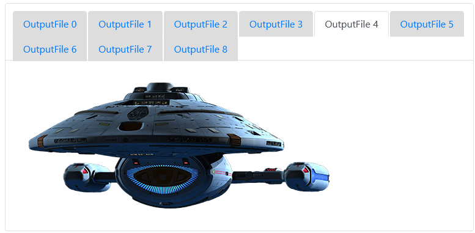
  <figcaption>ViPLab Frontend - Images</figcaption>
</figure>

#### ViPLab Graphics

<figure markdown>
  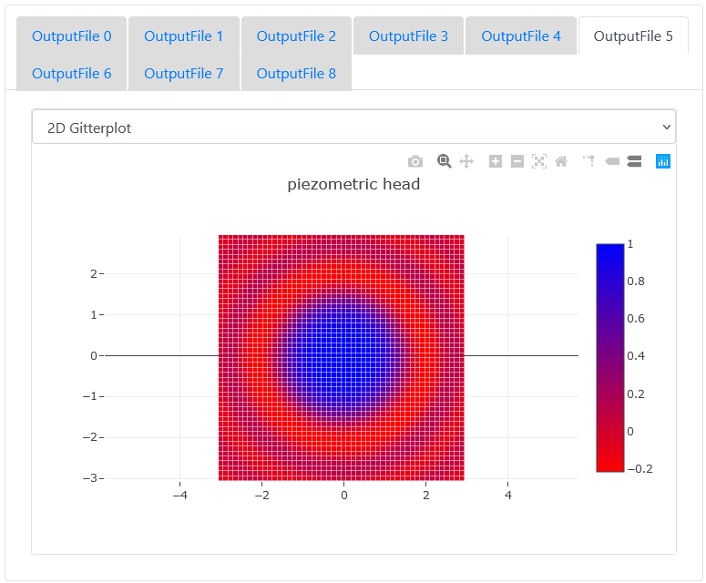
  <figcaption>ViPLab Frontend - ViPLab Graphics</figcaption>
</figure>

#### CSVs

<figure markdown>
  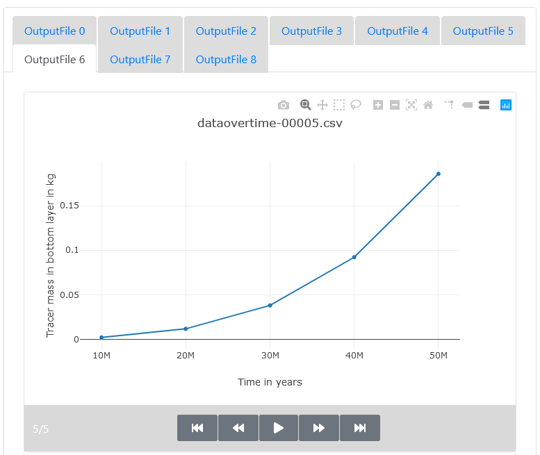
  <figcaption>ViPLab Frontend - CSVs</figcaption>
</figure>

#### VTKs

<figure markdown>
  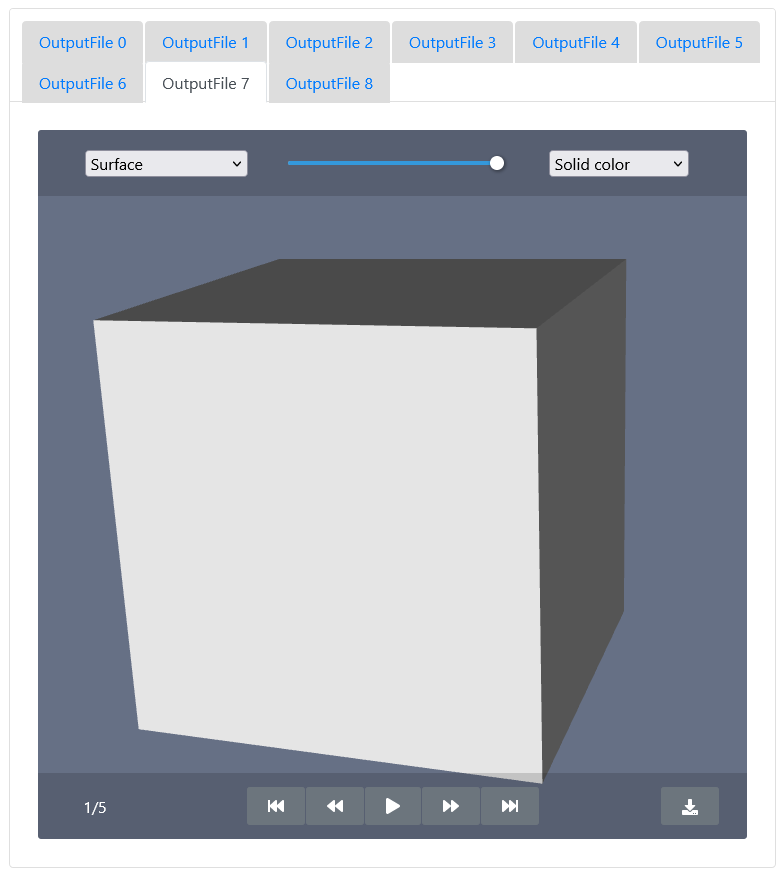
  <figcaption>ViPLab Frontend - VTKs</figcaption>
</figure>

### Downloads Tab

<figure markdown>
  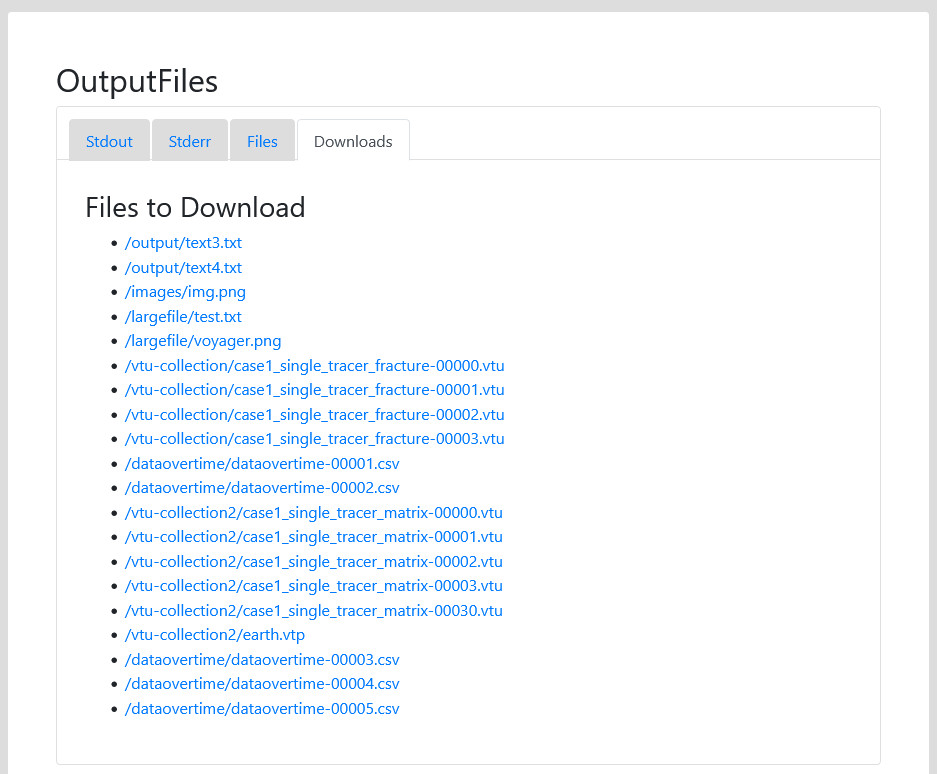
  <figcaption>ViPLab Frontend - Downloads</figcaption>
</figure>

