# Tutorial

## Situation
You have done some research and want to make the code you created available to other scientists, so they can take a better look at your results. 
For this, ViPLab was integrated into your institutions management system for research data (see Chapter on [Integration](../admin/integration.md))

---

## Steps
1. Create a Docker Container of your Research Software, that can be used by ViPLab
2. Write a Computation Template
3. See the Result in the ViPLab Frontend

---

### Easy Example
For this Tutorial we have created an [easy example code](https://github.com/VirtualProgrammingLab/viplab-example-docker), that just outputs information that was passed to the script using an INI-file and a C-file. 
For the last seven lines, some example output is copied inside the docker container, such that they are sent back as part of the result. 

The python script looks like this: 
``` python title="run.py"
import configparser
import shutil
import os

cwd = os.getcwd()

config = configparser.ConfigParser(allow_no_value=True)
config_file = cwd + '/data/shared/params.ini'
config.read(config_file)

print("Your name is \033[0;35m", config['about you']['name'], "\033[0m")
print("Your current age is", config['about you']['age'])
print("Your Christmas Wish is:", config['about you']['christmasWish'])
print("How hot do you like to drink your Coffee?", config['coffee preference']['coffeeTemperature'])
print("You like: \033[0;32m", config['about you']['likedThings'], "\033[0m")
print("Your favorite Programming Language is", config['about you']['favoritePL'])
print("Your look in the frige:", config['about you']['fridge'])
print("You would dance in the kitchen to:", config['about you']['dancing'])
print("You dislike: \033[0;31m", config['about you']['dislikedThings'], "\033[0m")
print("Your three random numbers are:", config['about you']['randomNumbers'])
print("You are an earthling?", config['about you']['earthling'])
print("Muuuuh:", config['about you']['muh'])

code_file = cwd + '/data/shared/code.c'
f = open(code_file, "r")
codeSnippet = f.read()
print("The Code you entered:")
print(codeSnippet)
f.close()

if config['about you']['earthling'] == 'true':
    shutil.copyfile(cwd + "/data/output/earth.vtp", cwd + "/data/shared/earth.vtp")
if config['about you']['muh'] == 'true':
    shutil.copyfile(cwd + "/data/output/cow.vtp", cwd + "/data/shared/cow.vtp")

shutil.copyfile(cwd + "/data/output/coffee-temp.csv", cwd + "/data/shared/coffee-temp.csv")
shutil.copyfile(cwd + "/data/output/coffee-consumption-00000.csv", cwd + "/data/shared/coffee-consumption-00000.csv")
shutil.copyfile(cwd + "/data/output/coffee-consumption-00001.csv", cwd + "/data/shared/coffee-consumption-00001.csv")
shutil.copyfile(cwd + "/data/output/coffee-consumption-00002.csv", cwd + "/data/shared/coffee-consumption-00002.csv")
shutil.copyfile(cwd + "/data/output/coffee-consumption-00003.csv", cwd + "/data/shared/coffee-consumption-00003.csv")
shutil.copyfile(cwd + "/data/output/coffee.jpg", cwd + "/data/shared/image-coffee.jpg")
shutil.copyfile(cwd + "/data/output/dance.png", cwd + "/data/shared/image-dance.png")
shutil.copyfile(cwd + "/data/output/uris.txt", cwd + "/data/shared/uris.txt")
shutil.copyfile(cwd + "/data/shared/params.ini", cwd + "/data/shared/input.ini")
shutil.copyfile(cwd + "/data/shared/code.c", cwd + "/data/shared/input.c")
```

An example for the input-file called params.ini could look like this: 
``` ini title="params.ini"
[coffee preference]
coffeeTemperature=75

[about you]
likedThings=programming,music,books
favoritePL=Java
fridge=never
dancing=Last Christmas
dislikedThings=Spiders
randomNumbers=25,50,75
name=Kathryn
christmasWish=COFFEE! In that nebula!
age=36
earthling=false
muh=true
```

Additionally the the input-file called code.c could look like this: 
``` c title="code.c"
int main(int argc, char **argv) { 
// Print 'Hello World' 
}
```

!!! tip inline end
    Remember to move to the correct directory using `cd [path-to-directory]/viplab-example-docker`, meaning the freshly cloned [example-repository](https://github.com/VirtualProgrammingLab/viplab-example-docker)!

To try out how the script works, run `run.py`:

Calling...
``` sh
python run.py
```

... will result in the following output on the console: 

``` console
Your name is Kathryn
Your current age is 36
Your Christmas Wish is: COFFEE! In that nebula!
How hot do you like to drink your Coffee? 75
You like:  programming,music,books
Your favorite Programming Language is Java
Your look in the frige: never
You would dance in the kitchen to: Last Christmas
You dislike:  Spiders
Your three random numbers are: 25,50,75
You are an earthling? false
Muuuuh: true
The Code you entered:
int main(int argc, char **argv) {
// Print 'Hello World'
}
```

### 1. Create a Docker Container of your Research Software, that can be used by ViPLab

If you are not familliar with Docker, follow this link to the official website to find the right Download for your system and take a look at the docs: [Docker Website](https://www.docker.com/).
There is also a [first introduction to Docker](https://docs.docker.com/get-started/) available, with a few explainations and an image to try out. 
To create and runs your first Docker sample application, you can follow this [Tutorial](https://docs.docker.com/get-started/02_our_app/). 

After you set up Docker, you can start writing a Dockerfile for your research software. 
The file is placed in the same folder as your code. 

For the example code above, the Dockerfile would look like this: 

``` docker title="Dockerfile"
FROM python:slim
COPY *.py /data/bin/
COPY earth.vtp /data/output/earth.vtp
COPY cow.vtp /data/output/cow.vtp
COPY coffee-temp.csv /data/output/coffee-temp.csv
COPY coffee-consumption-00000.csv /data/output/coffee-consumption-00000.csv
COPY coffee-consumption-00001.csv /data/output/coffee-consumption-00001.csv
COPY coffee-consumption-00002.csv /data/output/coffee-consumption-00002.csv
COPY coffee-consumption-00003.csv /data/output/coffee-consumption-00003.csv
COPY coffee.jpg /data/output/coffee.jpg
COPY dance.png /data/output/dance.png
COPY uris.txt /data/output/uris.txt
CMD ["python", "/data/bin/run.py"]
```
!!! info "Explaination of the Dockerfile"
    First the latest Ubuntu-Docker-Image is selected as a starting point. After this, our files are copied to specific folders inside the container. Then `run.py` is being executed.

After creating the file, open a terminal and go to the directory where your files are located, if you haven't done so, yet. 
To build the container image, run the following command:

``` docker
docker build -t viplab/viplab-example-image .
```

After the build is finished, you can now start the container using...

!!! tip inline end
    If you are on Windows, please use Powershell to execute the run command

```
docker run -v ${PWD}/shared:/data/shared -it viplab/viplab-example-image
```

... after which you will see the output shown in section [Easy Example](#easy-example). 

### 2. Write a Computation Template

To execute the software using ViPLab, a so called [Computation Template](../developer/computation_template.md) is needed. 
It is a JSON-file in which you not only define, how your software is executed, but also how the result will be displayed and generally what a user will see and what can be modified by him or her before executing your software.

To write a Computation Template you have to make several considerations. 

First, as the example is run using Docker, you have to set the `environment` to Container. 
Then you have to define how the application is run in the `configuration`-section of the json. 
Here, you set the image to execute. 
Additionally, other configuration-parameters for Docker can be set. 

``` json title="Define how to run the application"
{
  ...
  "environment" : "Container",
  ...
  "configuration" : { 
    "resources.image"  : "name://viplab/viplab-example-image",
    "resources.volume" : "/data/shared",
    "resources.memory" : "1g",
    "resources.numCPUs" : 1
  }
}
```

You can also use the Frontend to set these values:

<figure markdown>
  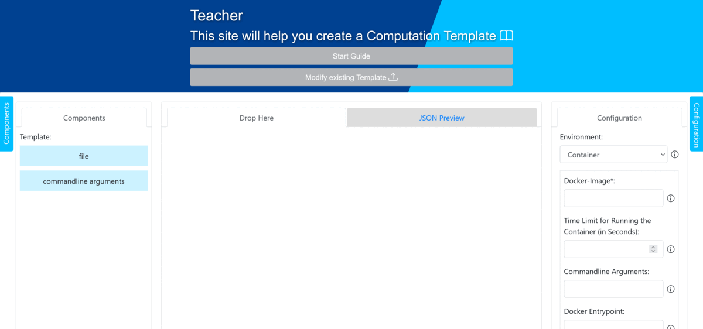
  <figcaption>ViPLab Frontend showing the Configuration of the Computation Template</figcaption>
</figure>

Before defining the input, let's set how the results will be displayed in the `output`-object inside the `metadata`-section. 
Using the array `viewer`, you can set whether CSV-files, ParaView-files, ViPLabGraphics and Images should be displayed in the result, or if they should only be downloadable. 
As the result of our Container contains Images, CSVs and ParaView-files, the respective values are set in the array. 
Further, connected result files can be defined with CSV- and ParaView-files. 
In this example, there are connected CSV-files, so the `csv`-object is added additionally. 
The CSV-files contain the mean of cups of coffee per day (x) over the last few years for women (y0) and men (y1), as an example, you can see the content of coffee-consumption-0003.csv: 

``` ini title="coffee-consuption-0003.csv"
year,women,men
2019,16,4
2020,12,3
2021,8,2
2022,6,1
```

In each file one data-point is added, e.g. coffee-consumption-0000.csv contains the data for 2019, coffee-consumption-0001.csv contains the data for 2019 and 2020 and so on. 
As you can see, the example-files start with the same `basename` "coffee-consumption", that is added to the object. 
Now labels, factor and format for the x-axis can be set. 
As there are two y-values, one for women and one for men, we decide that two plots should be displayed. 
They are defined and configured using the `plots`-array. 
The described output-configuration can be seen below: 

``` json title="Define how the result will be displayed"
{
  ...
  "metadata": { 
    "displayName" : "Parameters Example",  
    "description" : "This is a 'Hello World' example showing the usage of parameters. Please introduce yourself so that the Hello World-Container can print your information...",
    "output" : {
      "viewer" : ["CSV", "ParaView", "Image"],
      "csv" : [
        {
          "basename": "coffee-consumption",
          "xlabel": {
            "key": "year",
            "label": "Time in years",
            "format": ".0d"
          },
          "plots": [
            {
              "key": "women",
              "label": "Cups of Coffee per Woman"
            },
            {
              "key": "men",
              "label": "Cups of Coffee per Man"
            }
          ]
        }
      ]
    }
  }  
  ...
} 
```

This is how you can define the output using the Frontend:

<figure markdown>
  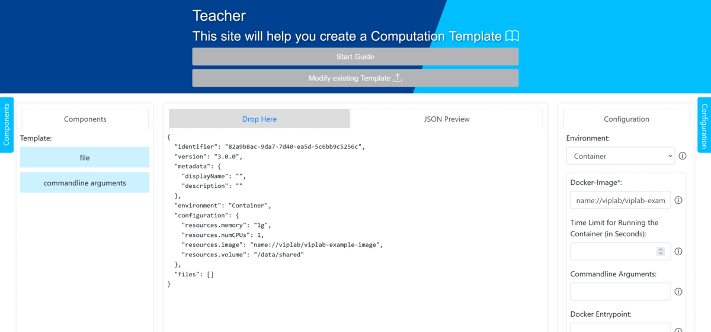
  <figcaption>ViPLab Frontend showing the Output-Configuration of the Computation Template</figcaption>
</figure>

For the Template, you need all the input for your application: Commandline arguments and input-files. 
Using the input-files, you can also let the users make changes to code. 
Files can consist of multiple parts. 
In a part, you can also show code to the user, that can't be modified, to give the user more information, by setting the "access" to "visible". 
Code can be modified by setting "access" to "modifiable", or hidden by "invisible". 
If you want the user to input their changes by using form-elements, for example such that non-programmers can also try out your application, this can be done by setting "access" to "template". 
Then you can choose form-elements for value-selection, just as you can do it for commandline arguments. 
As an example: 
For the selection of numbers, you could use an input-field of type number or a slider. 
To select multiple text-values, you can use either checkbox or a dropdown and to give the user more freedom, you can also choose an input-field with type text or an editor for generating the necessary input.

To input the user changes into your program, the "content" of the parts can be set as a [Handlebars.js](https://handlebarsjs.com/guide/) template. 
For the easy example, this feature is used to generate both input files: `params.ini` and `code.c`. 
In this case, `params.ini` was split into two parts that is later merged to one file internally by ViPLab. 

Using a handlebars expression, one can replace parts of the template with user input, when it is executed. 
In this case `{{__sliderSingle__}}` is replaced by the input from the user. 

``` ini title="params.ini Part 1 as Handlebars.js-Template"
[coffee preference]
coffeeTemperature={{__sliderSingle__}}
```

The second part of the `params.ini`-Template is more complicated, as the input contains lists. 
For more detailed information on each handlebars functionality visit the link above. 
For example using `each`, one can iterate over an array, `if` enables one to make conditionals and `@last` helps you to refer to the last item of an array. 

To illustrate this a bit better, let's take a look at the line `likedThings={{#each __checkbox__}}{{#if @last}}{{.}}{{else}}{{.}}, {{/if}}{{/each}}` inside the template. 
The `likedThings` can have multiple values and as seen above, it has to be a list of items separated by a comma: `likedThings=programming,music,books`. 
In this example, we decided to supply a few values to the users using a checkbox, such that they can select from a limited number of items. 
This also prevents the user from entering incorrect or dangerous (as in malicious) input.
As explained in [Computation Task](../developer/computation_task.md), the output of a checkbox-element consists of an array of strings. 
This array needs to be converted to a comma-separated list. 

``` ini title="params.ini Part 2 as Handlebars.js-Template"
[about you]
likedThings={{#each __checkbox__}}{{#if @last}}{{.}}{{else}}{{.}}, {{/if}}{{/each}}
favoritePL={{__radioButton__}}
fridge={{__dropdownSingle__}}
dancing={{#each __dropdownMultiple__}}{{#if @last}}{{.}}{{else}}{{.}}, {{/if}}{{/each}}
dislikedThings={{#each __toggle__}}{{#if @last}}{{.}}{{else}}{{.}}, {{/if}}{{/each}}
randomNumbers={{#each __sliderMultiple__}}{{#if @last}}{{.}}{{else}}{{.}}, {{/if}}{{/each}}
name={{{__inputTextWOMaxlength__}}}
christmasWish={{__inputTextWMaxlength__}}
age={{__inputNumber__}}
earthling={{__earth__}}
muh={{__cow__}}
```

``` ini title="code.c as Handlebars.js-Template"
{{{__default__}}}
```

All these Handlebars-templates need to be added the the content of the parts as Base64url-encoded strings.

---

All of this, of course can be done by just writing the JSON using a text-editor, but the ViPLab Frontend can also be used for this. 
For this, there is the feature of a GUI Creator integrated in the Frontend. 

To add files, parts of files, commandline arguments and specific GUI elements to set parameters, you have to drag and drop them from the left panel to the middle. 
By seleting on one component on the left by clicking and holding it, the middle displays colors where you can drop the component (green for dropable and red for not dropable). 

<figure markdown>
  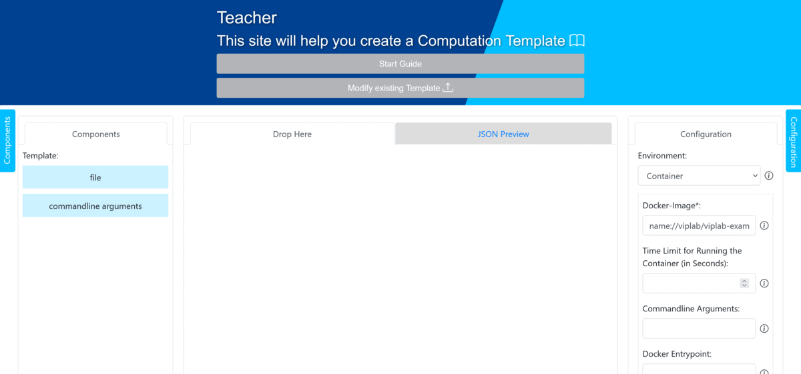
  <figcaption>ViPLab Frontend showing the Dragging and Dropping of Components</figcaption>
</figure>

By clicking on the added components in the middle, you can configure them on the right. 
On the left you can also see, which components can now also be added. 

<figure markdown>
  
  <figcaption>ViPLab Frontend showing the Modification of Components</figcaption>
</figure>

After adding a part to the first file, as seen in the last GIF, you can further configure it and add content to it, as previously described above. 

<figure markdown>
  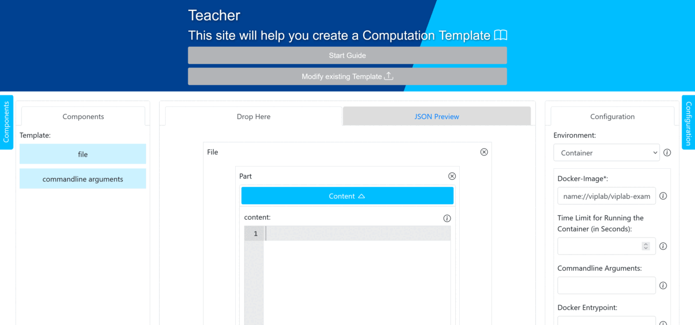
  <figcaption>ViPLab Frontend showing the Modification of Parts</figcaption>
</figure>

Repeat these steps with the remaining components. 
This will then result in the following:

<figure markdown>
  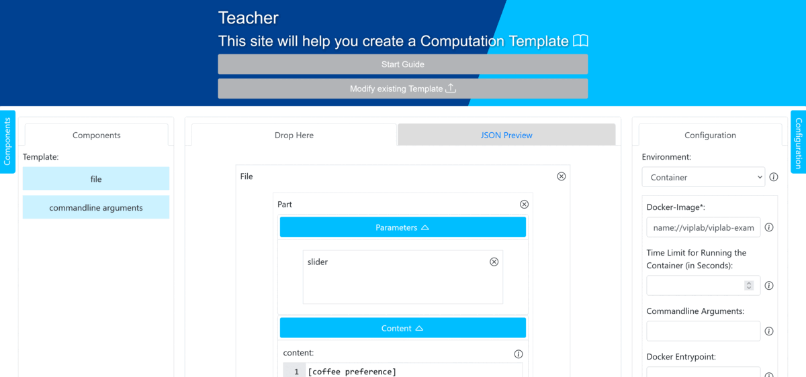
  <figcaption>ViPLab Frontend showing the finished Computation Template</figcaption>
</figure>

After finishing the template, you can validate, preview and download the Computation Template:

<figure markdown>
  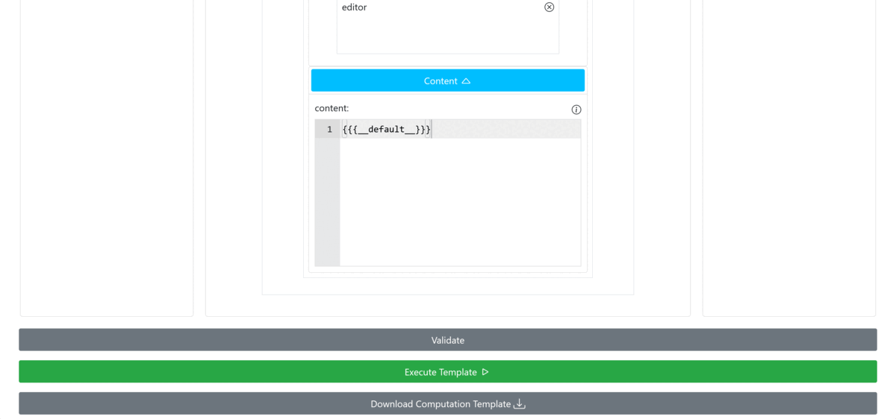
  <figcaption>ViPLab Frontend showing the Validation and Preview of the Computation Template</figcaption>
</figure>

---

Here, you can see the Copmutation Template as JSON, asking for the input of the user: 

``` json title="Computation Template of the Example"
{ 
  "identifier"  : "11483f23-95bf-424a-98a5-ee5868c85c3f", 
  "version" : "3.0.0",
  "metadata": { 
    "displayName" : "Parameters Example",  
    "description" : "This is a 'Hello World' example showing the usage of parameters. Please introduce yourself so that the Hello World-Container can print your information...",
    "output" : {
      "viewer" : ["CSV", "ParaView", "Image"],
      "csv" : [
        {
          "basename": "coffee-consumption",
          "xlabel": {
            "key": "year",
            "label": "Time in years",
            "format": ".0d"
          },
          "plots": [
            {
              "key": "women",
              "label": "Cups of Coffee per Woman"
            },
            {
              "key": "men",
              "label": "Cups of Coffee per Man"
            }
          ]
        }
      ]
    }
  },
  "environment" : "Container", 
  "files" : 
  [
    { 
      "identifier": "22483f42-95bf-984a-98a5-ee9485c85c3f", 
      "path"      : "params.ini",                              
      "metadata"  : {  
        "syntaxHighlighting": "ini"                   
      },
      "parts" : 
      [
        {
          "identifier": "f3fc4404-3529-4962-b252-47bc4ddd02a1",
          "access": "template",
          "metadata": {
            "name": "Parameter in part"
          },
          "parameters" : 
          [
            {
              "mode" : "any",
              "identifier" : "__sliderSingle__", 
              "metadata" : {
                "guiType" : "slider",
                "name": "Temperature",
                "vertical": false,
                "description" : "How hot do you like your coffee? (in degrees Celsius) - Tip: Typical Serving Temperature lies between 65 and 70 Degrees"
              },
              "default": [
                75
              ],
              "min": 0,
              "max": 90,
              "step": 5,
              "validation": "range"
            }
          ],
          "content": "W2NvZmZlZSBwcmVmZXJlbmNlXQpjb2ZmZWVUZW1wZXJhdHVyZT17e19fc2xpZGVyU2luZ2xlX199fQ"
        },
        {
          "identifier": "ceb051d8-b50c-4814-983a-b9d703cae0c6",
          "access"    : "template",
          "metadata"  : { 
            "name"      : "params.ini file part"
          },
          "parameters":
          [
            {
              "mode" : "fixed",
              "identifier" : "__checkbox__", 
              "metadata" : {
                "guiType": "checkbox",
                "name": "Things I like",
                "description" : "Select things you like"
              },
              "options": [
                {
                  "text" : "Programming",
                  "value" : "programming",
                  "selected" : true
                },
                {
                  "value" : "music"
                },
                {
                  "value" : "books"
                }
              ],
              "validation": "minone"
            }, 
            {
              "mode" : "fixed",
              "identifier" : "__radioButton__", 
              "metadata" : {
                "guiType": "radio",
                "name": "Favorite PL",
                "description" : "Select your favorite programming language"
              },
              "options": [
                {
                  "value" : "C"
                },
                {
                  "value" : "Java",
                  "selected" : true
                },
                {
                  "value" : "Haskell",
                  "disabled" : true
                },
                {
                  "text" : "Sssss... Python ...ssssS",
                  "value" : "Python"
                }
              ],
              "validation": "oneof"
            },
            {
              "mode" : "fixed",
              "identifier" : "__dropdownSingle__", 
              "metadata" : {
                "guiType": "dropdown",
                "name": "Fridge",
                "description" : "How often do look into the fridge a day?"
              },
              "options": [
                {
                  "value" : "Please choose one",
                  "disabled" : true
                },
                {
                  "value" : "never",
                  "selected" : true
                },
                {
                  "text" : "1 a day",
                  "value" : "Once a day"
                },
                {
                  "value" : "Twice a day"
                },
                {
                  "value" : "Three times a day"
                },
                {
                  "value" : "More than three times a day"
                }
              ],
              "validation": "oneof"
            }, 
            {
              "mode" : "fixed",
              "identifier" : "__dropdownMultiple__", 
              "metadata" : {
                "guiType": "dropdown",
                "name": "Dance Time",
                "description" : "To which songs would you dance in the kitchen?"
              },
              "multiple": true,
              "options": [
                {
                  "value" : "Please choose multiple",
                  "disabled" : true
                },
                {
                  "text" : "Last Christmas (aka the one that drives everybody else crazy)",
                  "value" : "Last Christmas",
                  "selected" : true
                },
                {
                  "value" : "White Christmas"
                },
                {
                  "value" : "Winter Woderland"
                },
                {
                  "value" : "Thats Christmas To Me", 
                  "selected" : true
                },
                {
                  "value" : "O Come All Ye Faithful", 
                  "disabled" : true
                }
              ], 
              "validation": "anyof"
            }, 
            {
              "mode" : "fixed",
              "identifier" : "__toggle__", 
              "metadata" : {
                "guiType": "toggle",
                "name": "NO!",
                "description" : "What do you dislike?"
              },
              "options": [
                {
                  "value" : "Spiders",
                  "selected" : true
                },
                {
                  "text" : "All kinds of Bugs (also the ones living in your Computer)",
                  "value" : "All kinds of Bugs"
                },
                {
                  "value" : "I never dislike anything!"
                }
              ], 
              "validation": "anyof"
            }, 
            {
              "mode" : "any",
              "identifier" : "__sliderMultiple__", 
              "metadata" : {
                "guiType" : "slider",
                "name": "random numbers",
                "vertical": true,
                "description" : "Choose three random numbers to be output by the container"
              },
              "default": [
                25,
                50,
                75
              ],
              "min": 0,
              "max": 100,
              "step": 5,
              "validation": "range"
            },
            {
              "mode" : "any",
              "identifier" : "__inputTextWOMaxlength__", 
              "metadata" : {
                "guiType" : "input_field",
                "type": "text",
                "name": "name",
                "description" : "Enter your name"
              },
              "default" : [""],
              "validation": "none"
            },
            {
              "mode" : "any",
              "identifier" : "__inputTextWMaxlength__", 
              "metadata" : {
                "guiType" : "input_field",
                "type": "text",
                "name": "Christmas Wish",
                "description" : "Enter what you wish for at christmas"
              },
              "maxlength": 200,
              "default" : [""],
              "validation": "pattern", 
              "pattern": "^[A-z_! ]+$"
            },
            {
              "mode" : "any",
              "identifier" : "__inputNumber__", 
              "metadata" : {
                "guiType" : "input_field",
                "type": "number",
                "name": "Age",
                "description" : "Enter your current age"
              },
              "default": [25],
              "min": 0,
              "max": 100,
              "step": 1,
              "validation": "range"
            },
            {
              "mode" : "fixed",
              "identifier" : "__earth__", 
              "metadata" : {
                "guiType": "radio",
                "name": "Earthling",
                "description" : "Are you an earthling?"
              },
              "options": [
                {
                  "text" : "Earthling",
                  "value" : "true",
                  "selected" : true
                },
                {
                  "text" : "Alien",
                  "value" : "false"
                }
              ],
              "validation": "oneof"
            },
            {
              "mode" : "fixed",
              "identifier" : "__cow__", 
              "metadata" : {
                "guiType": "radio",
                "name": "Muuuuh like a Cow",
                "description" : "Select if you muuuuuuh!"
              },
              "options": [
                { 
                  "text" : "Muh",
                  "value" : "true",
                  "selected" : true
                },
                {
                  "text" : "Kikirikiii",
                  "value" : "false"
                }
              ],
              "validation": "oneof"
            }
          ],
          "content"   : "W2Fib3V0IHlvdV0NCmxpa2VkVGhpbmdzPXt7I2VhY2ggX19jaGVja2JveF9ffX17eyNpZiBAbGFzdH19e3sufX17e2Vsc2V9fXt7Ln19LCB7ey9pZn19e3svZWFjaH19DQpmYXZvcml0ZVBMPXt7X19yYWRpb0J1dHRvbl9ffX0NCmZyaWRnZT17e19fZHJvcGRvd25TaW5nbGVfX319DQpkYW5jaW5nPXt7I2VhY2ggX19kcm9wZG93bk11bHRpcGxlX199fXt7I2lmIEBsYXN0fX17ey59fXt7ZWxzZX19e3sufX0sIHt7L2lmfX17ey9lYWNofX0NCmRpc2xpa2VkVGhpbmdzPXt7I2VhY2ggX190b2dnbGVfX319e3sjaWYgQGxhc3R9fXt7Ln19e3tlbHNlfX17ey59fSwge3svaWZ9fXt7L2VhY2h9fQ0KcmFuZG9tTnVtYmVycz17eyNlYWNoIF9fc2xpZGVyTXVsdGlwbGVfX319e3sjaWYgQGxhc3R9fXt7Ln19e3tlbHNlfX17ey59fSwge3svaWZ9fXt7L2VhY2h9fQ0KbmFtZT17e3tfX2lucHV0VGV4dFdPTWF4bGVuZ3RoX199fX0NCmNocmlzdG1hc1dpc2g9e3tfX2lucHV0VGV4dFdNYXhsZW5ndGhfX319DQphZ2U9e3tfX2lucHV0TnVtYmVyX199fQ0KZWFydGhsaW5nPXt7X19lYXJ0aF9ffX0NCm11aD17e19fY293X199fQ"
        }
      ]
    },
    { 
      "identifier": "22483f42-95bf-984a-98a5-ee9485c85c31", 
      "path"      : "code.c",                              
      "metadata"  : {  
        "syntaxHighlighting": "c_cpp"                   
      },
      "parts" : 
      [
        {
          "identifier": "f3fc4404-3529-4962-b252-47bc4ddd02a2",
          "access": "template",
          "metadata": {
            "name": "Parameter in part"
          },
          "parameters" : 
          [
            {
              "mode" : "any",
              "identifier" : "__default__", 
              "metadata" : {
                "guiType" : "editor", 
                "name": "code",
                "description" : "Enter some code"
              },
              "default": ["aW50IG1haW4oaW50IGFyZ2MsIGNoYXIgKiphcmd2KSB7IA0KLy8gUHJpbnQgJ0hlbGxvIFdvcmxkJyANCn0"],
              "validation": "none"
            }
          ],
          "content": "e3t7X19kZWZhdWx0X199fX0"
        }
      ]
    }
  ],
  "configuration" : { 
    "resources.image"  : "name://viplab/viplab-example-image",
    "resources.volume" : "/data/shared",
    "resources.memory" : "1g",
    "resources.numCPUs" : 1
  }
}
```

For more details on the structure of the Computation Template, take a look at the [Developer Guide](../developer/computation_template.md).

### 3. See the Result in the ViPLab Frontend

Using the above created Computation Template, the Frontend will look like this: 

<figure markdown>
  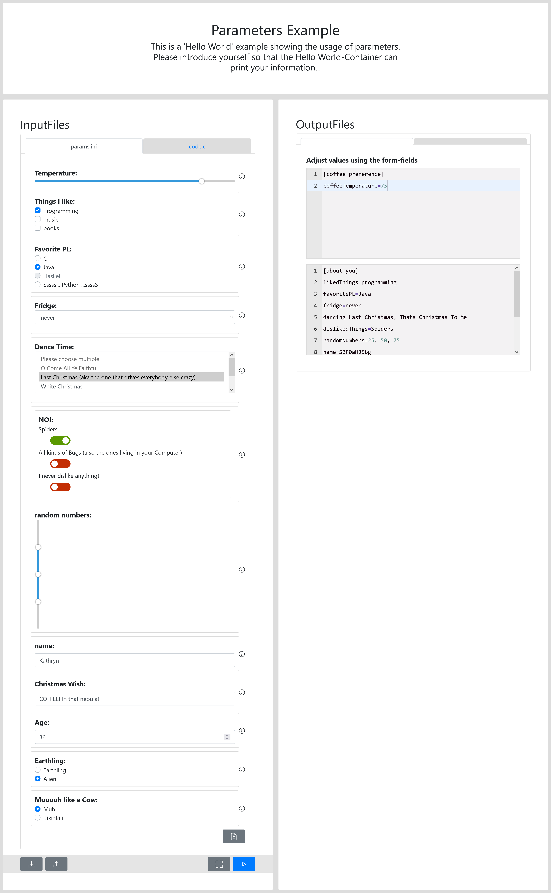
  <figcaption>ViPLab Frontend showing the Example</figcaption>
</figure>

After clicking the Play-Button, the Container will be executed by the Frontend and the Result will be returned, as seen in the Images below:

!!! success "Result after Running the Example using ViPLab"

    === "Result - Stdout"

        <figure markdown>
          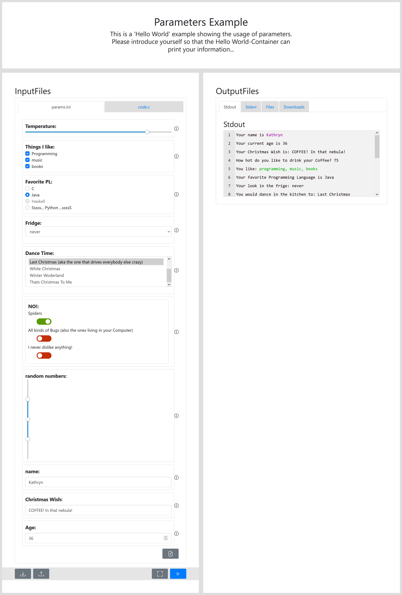
          <figcaption>ViPLab Frontend showing the Stdout</figcaption>
        </figure>

    === "Result - Stderr"

        <figure markdown>
          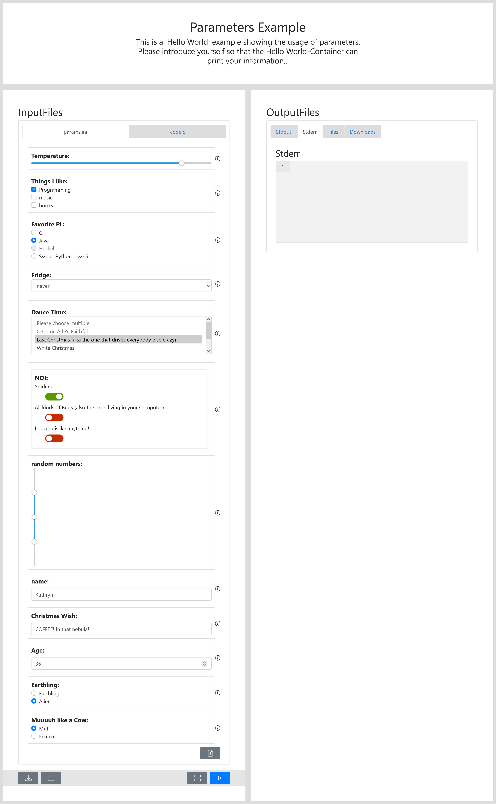
          <figcaption>ViPLab Frontend showing the Stderr</figcaption>
        </figure>

    === "Result - Files"

        <figure markdown>
          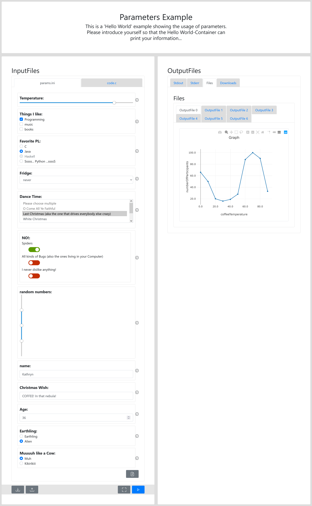
          <figcaption>ViPLab Frontend showing the Files</figcaption>
        </figure>

    === "Result - Download Links"

        <figure markdown>
          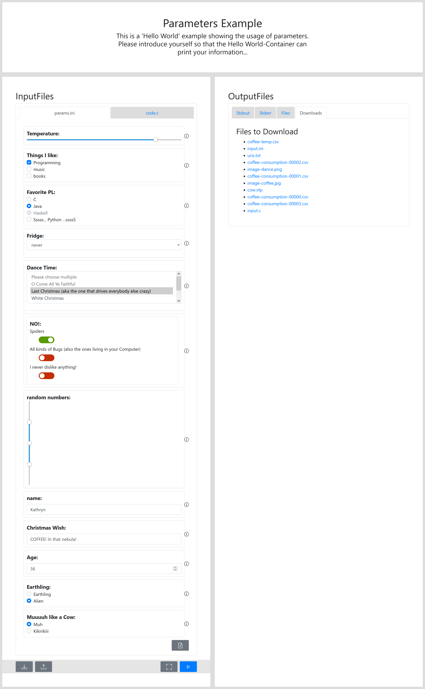
          <figcaption>ViPLab Frontend showing the Download Links</figcaption>
        </figure>