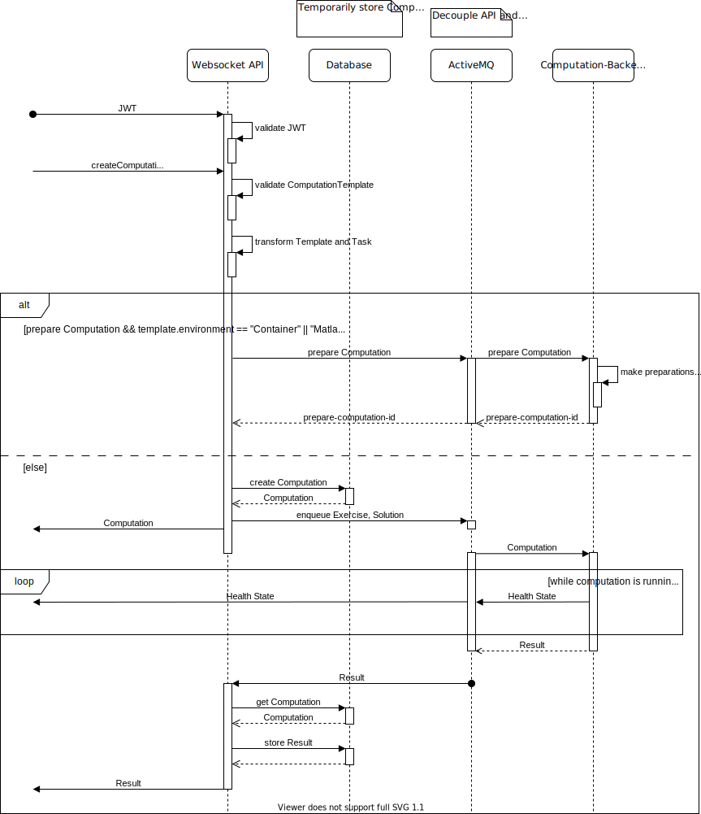

ViPLab 3.0
========================
Virtual programming laboratory for education and teaching at universities as well as executing docker images in the context of research data management. Clients (frontends) use the *websocket-api* to communicate to several backends (computation clients) working in a cluster. 

A _computation client_ instance supports one or more *language environments* (e.g. 'C', 'Matlab').

This documentation describes the json-messages used by the different ViPLab components to fulfill all the various features of ViPLab.

Terms (ViPLab specific)
-----
* **ViPLab** virtual programming laboratory (for programming this term is more generic than *NumLab* (outdated))
* **NumLab** legacy term for ViPLab (don't use it for new documentation)
* **ViP** 
    * ViPLab shortcut
    * "Virtuelles Programmierlabor" (German project shortcut)
* **CC** computation client, also backend
* **FC** frontend client; has different views:
    * teacher view or view of a researcher creating a new *computation template*
    * student view or view of a researcher executing an existing *computation*
* **client** a system component interacting with the *websocket-api*, e.g. backends, frontends
* **frontend launcher** entrypoints for the user, that start the frontend, e.g. viplab-question-plugin-for-ilias or dataverse-viplab-extension
* **computation** a CC computes a *Result* of a *Computation Task* complementing a *Computation Template* (*Computation Task* and - referenced - *Computation Template* being input, *Result* output of computation).

Flow of information
-------------------
<figure markdown>
  
  <figcaption>ViPLab Sequence Diagram</figcaption>
</figure>

After establishing a connection to the Websocket API, a JWT is sent for authentication. 
This JWT is then verified by the Websocket API. 
If it is valid, the Requestor can send a createComputation message to the Websocket API. 
The message contains the Computaton Template and a Computation Task. 
Receiving the message, the Websocket API verifies the Computation Template and combines the Template and the Task into a Computation. 
Subsequently, a message is sent to ActiveMQ, to request the Result. 
Additionally, the Computation is returned to the Requestor.  
This message gets pushed to the Computation-Backend, which in turn computes a Result, that is sent to the Websocket API via ActiveMQ. 
Before returning the Result to the initial Requestor, the Websocket API gets the Computation and stored the Result from/in its temporary Datastore. 

Development Help
-------------
For further developing ViPLab or related services, you can use the [local development environment based on Docker](https://github.com/VirtualProgrammingLab/viplab-docker-dev-env).

Versioning rules
----------------
[Versioning rules](versioning.md)

Long living JSON messages
--------------

* [Computation Template](computation_template.md)
* [Computation Task](computation_task.md)
* [Computation Result](computation_result.md)

Wrapper
---------
* [Computation](computation.md)

Message Types
-------------
* [CreateComputation](create_computation.md)
* [Result](result.md)
* [System status](system_status.md) (not implemented yet)
* [Computation Interrupt](computation_interrupt.md) (not implemented yet)
